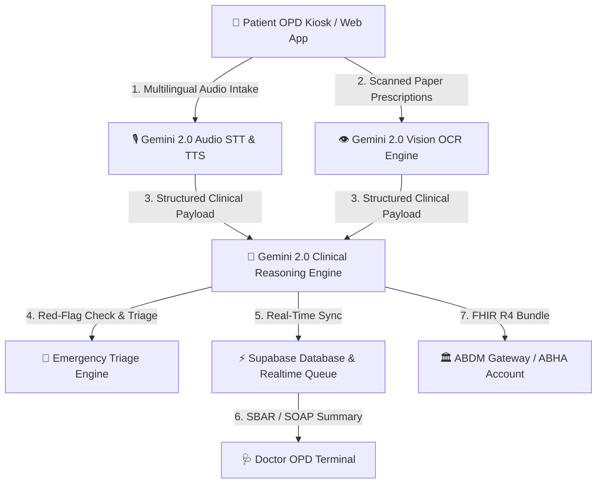

# 🩺 SwasthaSetu (स्वास्थ्यसेतु) — Bridge to Healthcare

> **AI-Powered Pre-Consultation Clinical History, Multilingual Voice Intake & Medical OCR Bridge for Indian Healthcare**  
> *Aligned with the Ayushman Bharat Digital Mission (ABDM) & Digital Personal Data Protection (DPDP) Act 2023.*

---

## 📌 Executive Summary

In Indian tertiary government and private hospitals, outpatient department (OPD) doctors manage **up to 4,000+ patients daily**, limiting average consultation times to just **2–5 minutes per patient**. Up to **70–80% of clinical diagnoses** rely heavily on a detailed medical history, yet valuable doctor-patient time is routinely lost to manual scribing, language translation, and deciphering paper prescriptions.

**SwasthaSetu** bridges this critical gap. Operating via OPD hospital kiosks or patient smartphones, SwasthaSetu conducts an interactive **multilingual voice and touch clinical intake interview**, digitises paper health records using **Gemini 2.0 Vision OCR**, flags life-threatening clinical red-flags (e.g., STEMI / Cardiac Risk), and delivers a **physician-ready structured clinical summary (SBAR/SOAP)** directly to the doctor's terminal before the patient enters the consultation room.

---

## 🌟 Key Features & Capabilities

### 🗣️ 1. 8-Language Voice & Touch AI Intake Wizard
- **Google Gemini 2.0 Transcribe ASR & Audio Synthesis**: Hands-free voice speech-to-text (STT) and text-to-speech (TTS) in **8 Indian languages** (*Hindi, Tamil, Telugu, Marathi, Bengali, Kannada, Malayalam, and English*).
- **SOCRATES Symptom Framework**: Structured history taking (Site, Onset, Character, Radiation, Associations, Timing, Exacerbating factors, Severity 1-10).
- **AYUSH Dashavidha Pariksha**: Dedicated Ayurvedic patient assessment covering Prakriti, Agni, Dhatu, and Vikriti profiling.

### 📄 2. 3-Tier Gemini Vision OCR & Medical Document Guardrail
- **Tier 1 (Digital PDFs)**: Direct structured parameter extraction from lab reports and e-prescriptions.
- **Tier 2 (Scanned / Handwritten Copies)**: Deep vision extraction for physical paper records, discharge summaries, and lab values.
- **Tier 3 (Unreadable Data Guardrail)**: Automatic flagging of blurry/smudged details as `[UNREADABLE_DATA]` to prevent medical hallucination.
- **Non-Medical Document Rejection**: Intelligent vision guardrail that detects and rejects invalid files (electricity bills, receipts, ID cards) from entering the EHR.

### 🚨 3. Real-Time Red Flag Clinical Triage
- **Critical Alert Detection**: Instant identification of high-risk symptoms (e.g., STEMI chest pain, acute dyspnea, severe sepsis, neurological deficits).
- **Emergency Modal & ECG Order**: Prompts emergency triage alerts and orders emergency 12-lead ECG prior to routine OPD queueing.

### 📋 4. Physician-Ready Summary Terminal (Doctor Workspace)
- **Live Queue Synchronization**: Real-time push of intake summaries from OPD kiosks to the attending physician's terminal via **Supabase Realtime Database**.
- **SOAP & SBAR Formatting**: Standardized presentation including Chief Complaint, Timeline, History of Present Illness (HPI), Chronic Meds, OCR Extracted Labs, and Differential Diagnosis.

### 🔐 5. ABDM M1 & DPDP Act 2023 Compliance
- **ABHA Registration & Authentication**: Aadhaar-based OTP and ABHA ID verification.
- **Audio-Guided Consent**: Multi-lingual audio notice explaining data usage rights under the DPDP Act 2023.
- **HL7 FHIR R4 Bundle Export**: Standardized clinical artifact linking to the NHA ABDM Consent Manager network.

---

## 🏗️ Architecture & Technology Stack



### Stack Overview
- **Frontend & Routing**: React 18, TypeScript, Vite 8, TanStack Start, TanStack Router, Tailwind CSS, Lucide Icons.
- **AI & Multimodal Multilingual Engine**: `@google/genai` (Gemini 2.0 Flash Audio ASR/TTS, Gemini 2.0 Flash Vision OCR, Gemini Clinical Reasoning).
- **Database & Cloud Storage**: Supabase Postgres Database (`intake_sessions`), Supabase Realtime Storage, LocalStorage fallback cache.
- **Standards & Protocol**: HL7 FHIR R4 Bundles, ABDM Gateway Sandbox APIs, DPDP Act 2023 Consent Framework.

---

## 🚀 Quick Start Guide

### Prerequisites
- **Node.js**: v18.0.0 or higher
- **npm**: v9.0.0 or higher
- **Google Gemini API Key**: Get your key from [Google AI Studio](https://aistudio.google.com/)

### 1. Clone & Install Dependencies
```bash
git clone https://github.com/dearspartan/SwasthaSetu.git
cd SwasthaSetu
npm install
```

### 2. Environment Configuration
Create a `.env` file in the root directory:
```env
# Google Gemini API Key (Required for Audio Transcribe, Vision OCR & TTS)
VITE_GEMINI_API_KEY=AIzaSy...

# Supabase Project Credentials (Required for Live Doctor Queue Sync)
VITE_SUPABASE_URL=https://drrrrmrasdmzpksxmxvu.supabase.co
VITE_SUPABASE_PUBLISHABLE_KEY=sb_publishable_sxEmFuoz7i1lZVWEe8krRg_bbcNTcHX
```

### 3. Run Development Server
```bash
npm run dev
```
Open [http://localhost:3000](http://localhost:3000) in your browser.

### 4. Build for Production
```bash
npm run build
```

---

## 📱 Core User Journeys

| Route | Description |
| :--- | :--- |
| **`/`** | **Home Portal**: Overview of SwasthaSetu platform, ABDM integration, and OPD key statistics. |
| **`/intake`** | **Patient Intake Wizard**: 7-step guided interview (Consent ➔ Location ➔ Department ➔ Voice/Touch Interview ➔ Medical OCR ➔ AYUSH Intake ➔ Clinical Summary). |
| **`/doctor`** | **Doctor Workspace Terminal**: Real-time OPD queue dashboard with detailed SBAR/SOAP patient profiles. |
| **`/patient`** | **Patient Health Passport**: Personal ABHA profile, linked prescriptions, chronic meds, and past visits. |
| **`/login`** | **Portal Authentication**: ABHA ID + Aadhaar OTP login for patients and verified NMC/AYUSH registration login for doctors. |

---

## 📜 License & Compliance Notice

Designed and built for Indian healthcare facilities under the guidelines of:
- **Ayushman Bharat Digital Mission (ABDM)** Health Data Management Policy.
- **Digital Personal Data Protection (DPDP) Act 2023**.
- **National Medical Commission (NMC)** Registered Healthcare Provider Standards.

---
*Built with ❤️ for Indian Healthcare.*
